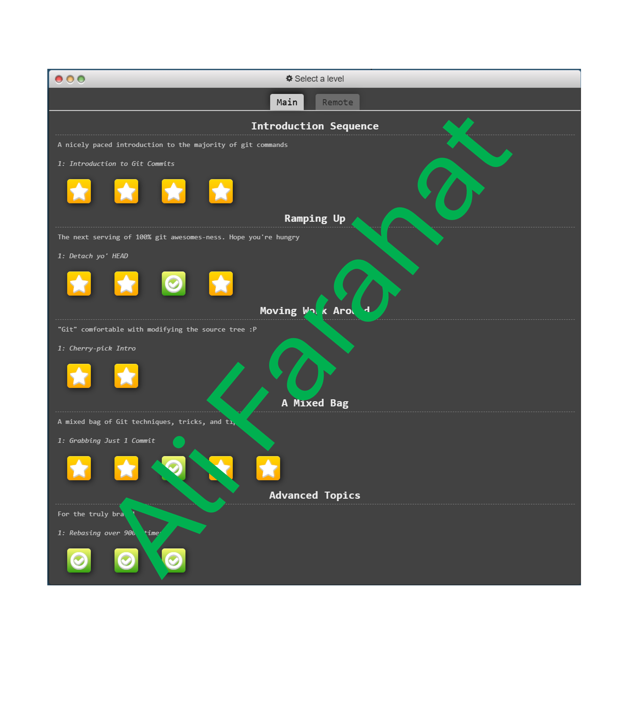

## 📝 Introduction
This is a sample project repo for HW2!

## Screenshots of Mohsen EsfandyariDoulabi

### ✅ Task List
- [x] Task 1: Complete Git Tutorial
- [x] Task 2: Add Screenshots to README.md
- [x] Task 3: Modify `.html` File
- [ ] Task 4: Merge Changes

## Screenshots of Ali Farahat
 

